# Information Gathering
- Exploring the functionality of the application
- Architecture of the application
- Client's network communications
- Files that can be accessed by the client
- Look for juicy files

## Tools of the trade:

- CFF Explorer → https://ntcore.com/?page_id=388
- Sysinternal Suite → https://learn.microsoft.com/en-us/sysinternals/downloads/sysinternals-suite
- Wireshark → https://www.wireshark.org/download.html 

---

# TCPVIEW - Network Connections

<aside>
💡 TCPView from Sysinternals is a Windows utility that provides real-time monitoring of TCP and UDP connections, allowing users to view detailed information about processes, local and remote IP addresses, and connection states.

</aside>

- Open **TCPView** from **SysinternalSuite** tools.

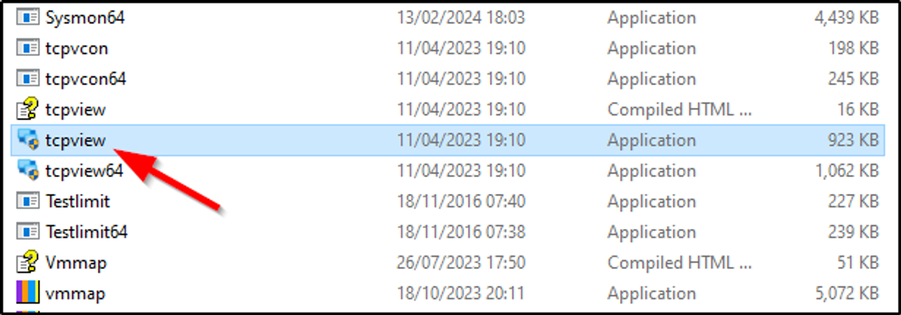

- When opened we got number of services that are using TCP and UDP connections.

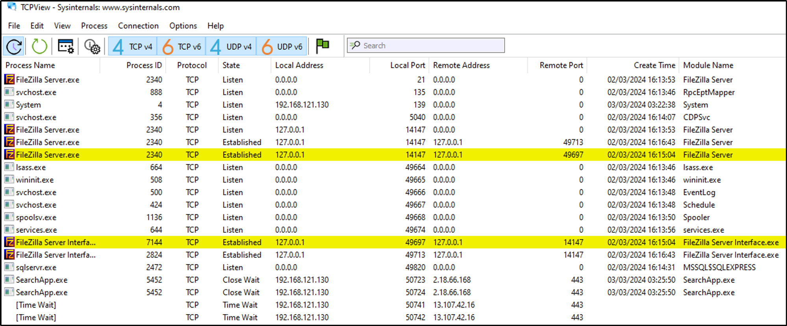

- Let’s play with opening the DVTA application and see how it loads, trying logging using any user creds.
- From the image below we can see anew connection is made by DVTA application on port: 49820.

<aside>
💡Local Address and Remote Addresses are same because we have setup the server on the same machine on which we are using the application

</aside>

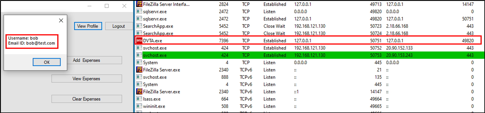

- So by this way we can see to which IP Address the application is communicating with.

---

# Wireshark - Network Connections

<aside>
💡 Wireshark is a network protocol analyzer that allows users to capture and interactively browse the traffic running on a computer network.

</aside>

- Open Wireshark and select “**Adapter for Loopback Traffic Capture**” (because here I’m using loopback address. WHY? because my app and sever is running on the same machine) and we might need to select the proper connection while testing from which the traffic is going.

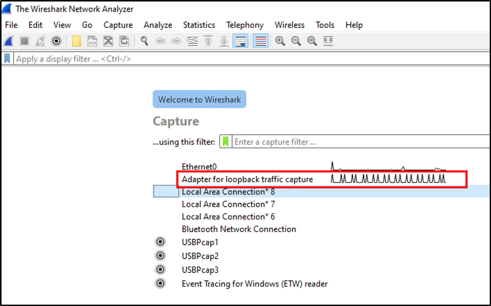

- When we try to again login using, Wireshark will capture the traffic going through the connections.
- So, when we hit login with creds in DVTA and click on expenses, we can view the data by right clicking on data request > Follow > TCP Stream.

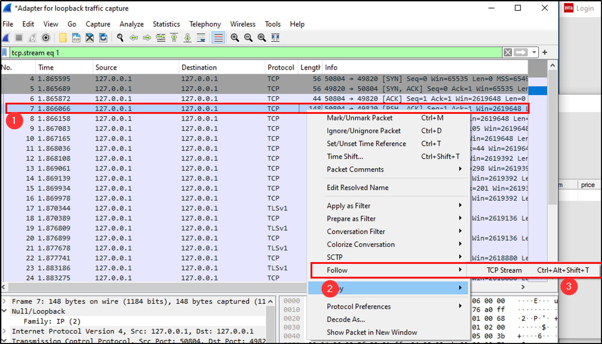

- We have got the captured traffic for the following stream.

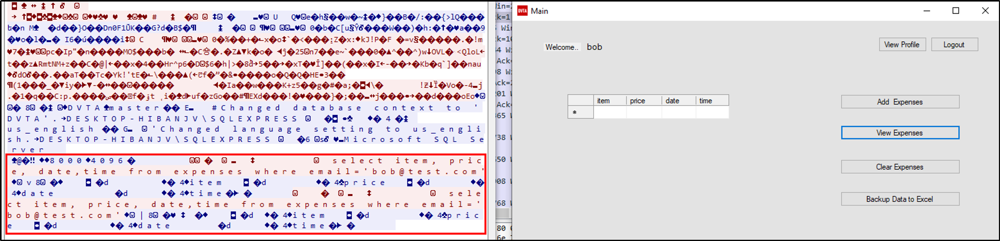

**This is just a intro to Wireshark, we’ll use it more in next sections.**

---

# Exploring PE file with CFF Explorer

<aside>
💡 CFF Explorer is a powerful tool for analyzing, modifying, and understanding Windows Portable Executable (PE) files, commonly used for debugging, reverse engineering, and software analysis purposes.

</aside>

- CFF Explorer is a powerful tool used to analyze on which language the application is build  on. Like if the application is build using C, C++ then we can try buffer overflow attacks or if application is build using .NET assembly then we can decompile the application and reverse engineer it.
- Now open CFF Explorer and open DVTA application by clicking **File > Open > Path to DVTA app.**

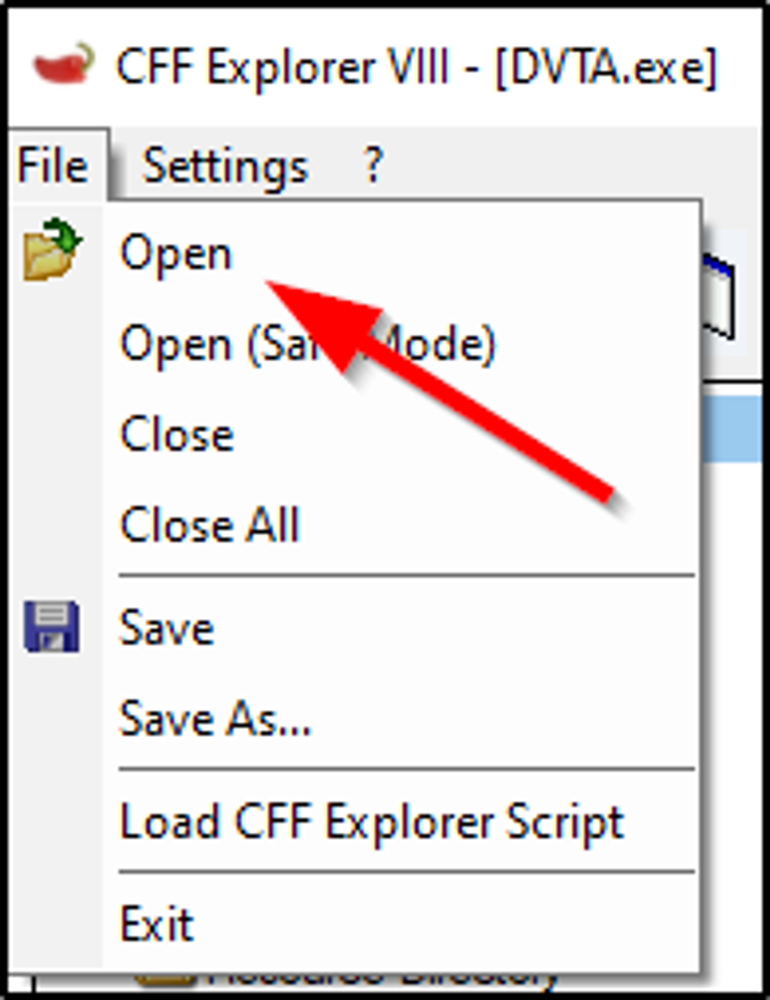

- When opened we can see the application is build using .NET Assembly hence we can decompile it.

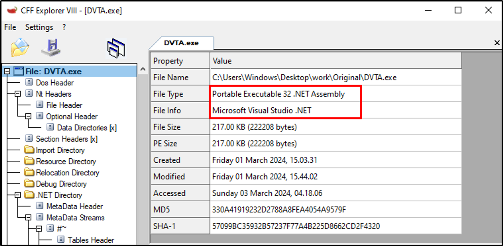

---

# Procmon - File system monitoring

<aside>
💡 Process Monitor, is a Windows utility used for real-time monitoring and logging of system activity, including file system, registry, process, and network activity.

</aside>

- When we started the “ProcMon” we see that a lot of traffic is going through.
- To make a clear view, select filter > Dropdown menu > Select Process Name > Enter process name DVTA.exe > OK.

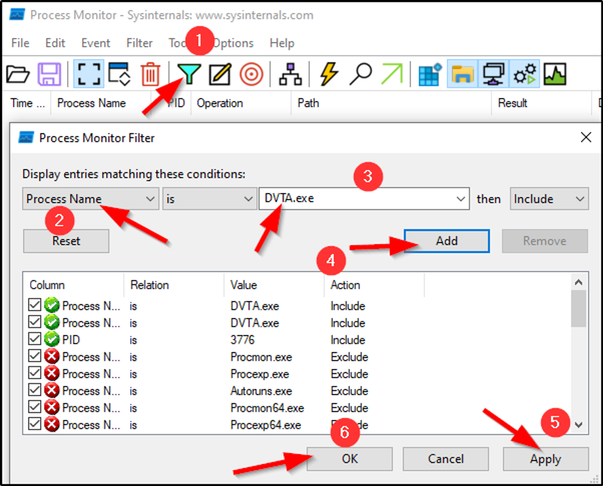

- So now here we have list of processes only for DVTA.
- By looking at the file paths the application is requesting we found “**DVTA.exe.config**” file.

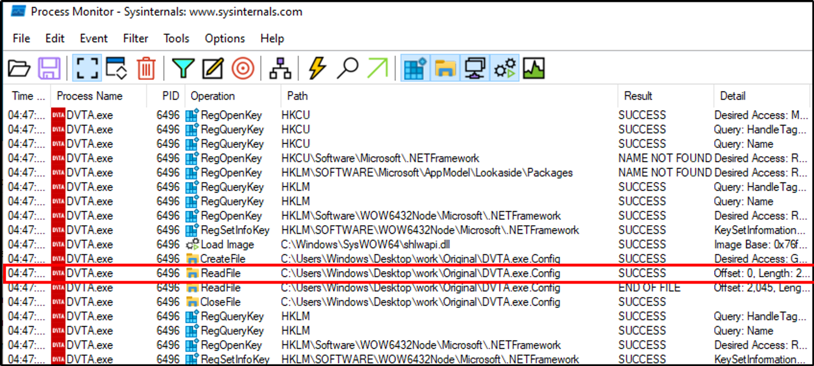

- We can directly jump to the location of this file by right click > Jump to.

- When got the file location, open the file the data in file.
- Here we have found some useful data about Database.

<aside>
💡 This is information gathering section so we are not trying any exploitation, but in coming we do it.

</aside>

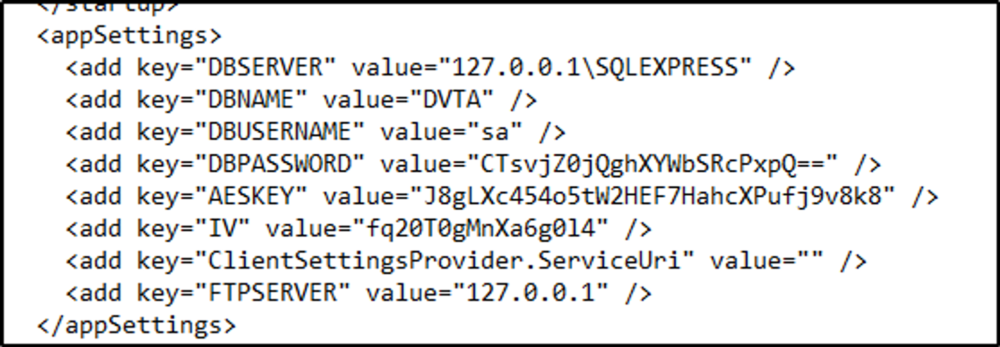

- Next let’s try closing the application and reopen it.
- By doing so we have got our session active already.
- Let’s explore the application again if we found something interesting.

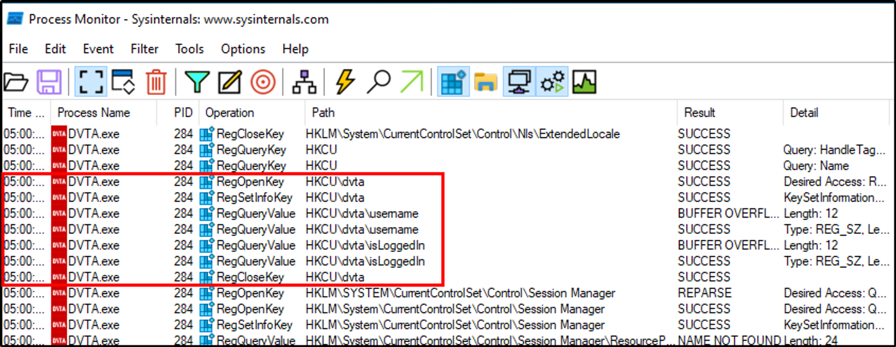

- So here we have found some registry on specific DVTA app let’s jump to it.
- By jumping to the location we have found that the application is storing user credentials in plain text.

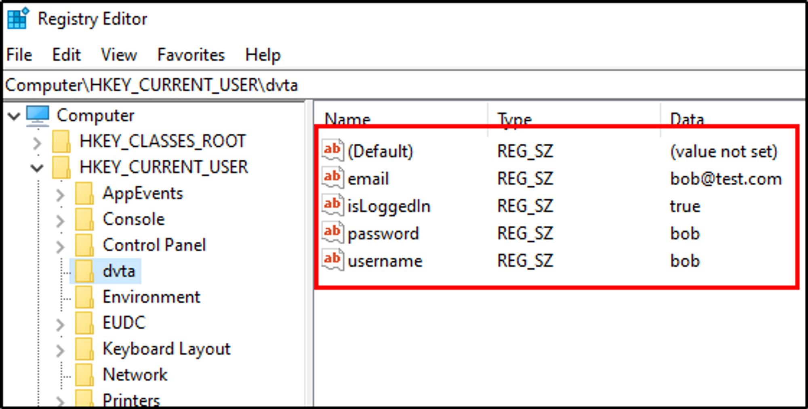

- It looks the application is tracking the session from isLoggedIn entry.
- By changing to false we can verify that the session gets terminated.
- By this way a user can change the values and login with any user which we’ll do in upcoming sections.
