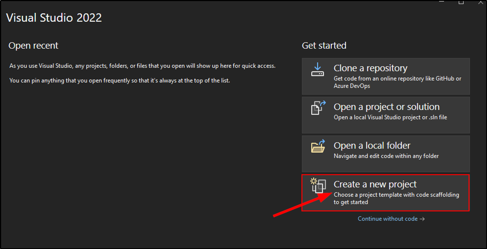
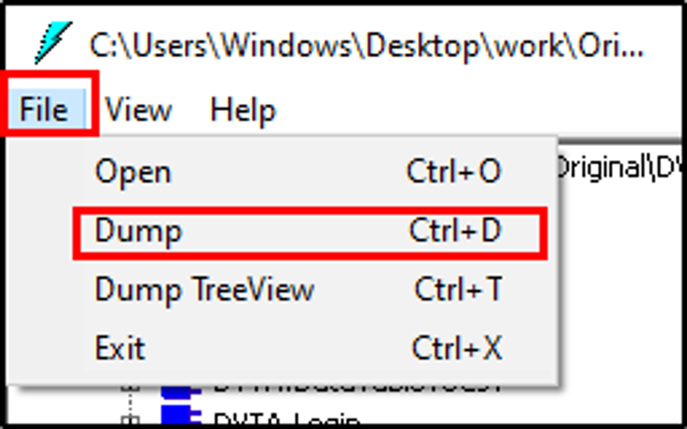

# Reversing and Patching

# Reversing Intro & Tools

---

<aside>
💡 Tools Used (Well, all tools performs almost similar functions):

- dnSpy
- dotPeek: https://www.jetbrains.com/decompiler/download/#section=web-installer
- ILSpy & Reflexil
- ILASM (IL Assembler) ( comes with .NET Framework)
- ILDASM (IL Disassembler) (comes with Visual Studio)
- Visual Studio: https://visualstudio.microsoft.com/downloads/
</aside>

---

## Installation of Visual Studio

- Download **Visual Studio** from the link above.
- Open the downloaded `.exe` file and click **Continue.**
- When new window opens select “**.NET Desktop Development**” and click **Install**.


- Wait for the installation to finish.

---

## Installation of DotPeek

- Download **DotPeek** from the provided link.
- When new window opens, Select **dotpeek <version>** and uncheck **Visual Studio Integration**.
- Select terms & conditions and click **Next**.


- In next window, simply click **Install**.


- Wait for the installation to finish and simply click **Exit** after finishing.

---

# DotPeek - Decompiling

---

- Open **DotPeek**, Select File > Open > Select DVTA.exe.


- We can see data related to DVTA application.
- Here we are exploring Login feature by **Double Clicking** → To decompile the **Login** page.


- On right side, we can see decompiled code for login page that uses **DBAcess** for login feature.


- We can find all **Libraries** used in code under the **DVTA > References.**
- Double click on “**DBAccess”** to get DBAccess class library code.


- Under DBAccess > DBAccess > DBAccessClass, we got **Password decrypt** logic code.


- With this **Decrypt Code Logic** we can decrypt the password we found hardcoded in dvta XML file.


---

## Recreating the Decryption Logic

- Open **Visual Studio** and click on **Create New Project**.



- In next window, search for **Forms,** and select **Windows Forms App (.NET Framework)**


- Give a name to your project and click **Create.**
- Next, in forms window drag and drop a Button from **Toolbox.**


- By double clicking on the button, we got code window which looks like below image:


- So, copy the decrypted code found above using dotpeek, copy the code and paste it on button coding.
- We did some changes to the coding have a look on actual code and modified code below:

```vbnet
#ORIGINAL_CODE
public string decryptPassword()
    {
      string s1 = ConfigurationManager.AppSettings["DBPASSWORD"].ToString();
      string s2 = ConfigurationManager.AppSettings["AESKEY"].ToString();
      string s3 = ConfigurationManager.AppSettings["IV"].ToString();
      byte[] inputBuffer = Convert.FromBase64String(s1);
      AesCryptoServiceProvider cryptoServiceProvider = new AesCryptoServiceProvider();
      cryptoServiceProvider.BlockSize = 128;
      cryptoServiceProvider.KeySize = 256;
      cryptoServiceProvider.Key = Encoding.ASCII.GetBytes(s2);
      cryptoServiceProvider.IV = Encoding.ASCII.GetBytes(s3);
      cryptoServiceProvider.Padding = PaddingMode.PKCS7;
      cryptoServiceProvider.Mode = CipherMode.CBC;
      this.decryptedDBPassword = Encoding.ASCII.GetString(cryptoServiceProvider.CreateDecryptor(cryptoServiceProvider.Key, cryptoServiceProvider.IV).TransformFinalBlock(inputBuffer, 0, inputBuffer.Length));
      Console.WriteLine(this.decryptedDBPassword);
      return this.decryptedDBPassword;
    }

#MODIFIED_CODE
 {
     string s1 = "CTsvjZ0jQghXYWbSRcPxpQ==";         //FOUND FROM THE FILE IN APPLICATION DIRECTORY
     string s2 = "J8gLXc454o5tW2HEF7HahcXPufj9v8k8";
     string s3 = "fq20T0gMnXa6g0l4";
     byte[] inputBuffer = Convert.FromBase64String(s1);
     AesCryptoServiceProvider cryptoServiceProvider = new AesCryptoServiceProvider();
     cryptoServiceProvider.BlockSize = 128;
     cryptoServiceProvider.KeySize = 256;
     cryptoServiceProvider.Key = Encoding.ASCII.GetBytes(s2);
     cryptoServiceProvider.IV = Encoding.ASCII.GetBytes(s3);
     cryptoServiceProvider.Padding = PaddingMode.PKCS7;
     cryptoServiceProvider.Mode = CipherMode.CBC;
     string decryptedDBPassword = Encoding.ASCII.GetString(cryptoServiceProvider.CreateDecryptor(cryptoServiceProvider.Key, cryptoServiceProvider.IV).TransformFinalBlock(inputBuffer, 0, inputBuffer.Length));
     Console.WriteLine(decryptedDBPassword);
 }
```


- After all click on **Start Debugging** and wait for the dubug to load.
- When we click on the button we got password decrypted in output console.


*NOTE: we can achieve the same using the console itself, so prefer the way you like :)*

In next task we’ll do the same using **dnSpy,** which is more easier than above method.

--- 

# DnSpy - Runtime Tracing

---

- Open **DnSpy** and open the dvta app by click **File > Open.**
- Locate the login page ( because we are interested in this as password decryption is happening here).


- Simply from the code window, click on DBAccess, it will take us to the classes page used in DBAccess.


- Click on **DBAccessClass,** it will take us to the coding page.


- So, finally we have landed to the actual code used in application to decrypt the password.


- At the revalent line, right click and add a **Breakpoint (**This will stop the program at this point and we have opportunity to view the output till breakpoint)


- Click on **Start** and select the application and click **OK.**


- Here the programs stops at breakpoint and we can see the username and password in output.
- We can also use the top little button to jump over to next lines of code and see the output results.


- By click on jump next we now got **ConnectionString** also in output.


---

# Setting up ILSpy & Reflexil

---

<aside>
💡 ***Tools Used:**

ILSpy:* https://github.com/icsharpcode/ILSpy/releases/tag/v8.2

*Reflexil:* https://github.com/sailro/Reflexil/releases/tag/v2.7

**Note: If latest version of tools didn’t work properly try older ones.**

</aside>

---

- One thing we have to do is: From **Reflexil** directory copy the `Reflexil.ILSpy.Plugin.dll` to `ILSpy`folder.


---

# Reflexil - Patching

---

<aside>
💡 We’ll use Reflexil and ILSpy to do privilege escalation. We’ll modify the application to access admin functionalities.

**NOTE: Make sure to save the application with the same name as original one.**

</aside>

- Open ILSpy, Open DVTA application by selecting **File > Open.**
- Under **Assemblies**, we can see DVTA application is added.


- Expand the application fully, and here we are interested in **Login** button. Let’s click it and decompile the login page.


- From reading the code, we can see `isadmin` is set to `0.`


- Next select the both languages from drop down, **IL and C#.**
- We can see the decompiled code in both languages, let’s open the **Reflexil** by click on small **Setting** button.


- In **Reflexil** window, locate the `ldc.i4` and change the value to 0 by right clicking > Edit.


- On selecting the `ldc.i4.0`, click on **Update.**


- Move to the DVTA’s main branch and right click > **Save as,** and save the new .exe file with the same name of application.


- On launching the application and login using the regular user credentials, we see we have successfully got admin access.


---

# ILASM & LDASM - Patching

---

<aside>
💡 Till now we are using 3rd party tools for performing actions, now we’ll use tools comes with **“Microsoft Visual Studio”** known as ***IL-Disassembler*** and similarly “**Dotnet”** framework comes with a tool called ***Assembler***.

**Process:**

Using ILDASM (IL-Disassember) ⇒ DVTA.exe ⇒ IL code ⇒ ILASM (IL-Assembler) ⇒ Modified DVTA file.

</aside>

**Path to IL-DASM:** *C:\Program Files (x86)\Microsoft SDKs\Windows\v10.0A\bin\NETFX 4.8 Tools\ildasm.exe*


**Path to IL-ASM:** *C:\Windows\[Microsoft.NET](http://microsoft.net/)\Framework\v4.0.30319\ilasm.exe*


**Note: Paths may vary so above is the approx path loaction.**

---

- Open `cmd`and go to `ildasm`location.
- By using `ildas.exe` give path to DVTA application.

```csharp
> cd "C:\Program Files (x86)\Microsoft SDKs\Windows\v10.0A\bin\NETFX 4.8 Tools\"

> ildasm.exe C:\Users\Windows\Desktop\work\Original\DVTA.exe
```

- Using the cmd above, a dialog box will appear.
- Select the DVTA application.


- By selecting DVTA application, click on **File > Dump**.



- In next dialog box simply click **OK.**


- Select suitable location to save the file and hit save.
- We can see a file named **[dvta.il](http://dvta.il)** is saved along with other files.


- Open [**dvta.il](http://dvta.il)** file with notepad and search for isadmin string.
- We found `ldc.i4.1`, user the isadmin.


- Change it’s value to `ldc.i4.0` and save the file.


- Now, navigate to the **IL-ASM** location and run `ilasm.exe` with **[dvta.il](http://dvta.il)** file.

```csharp
> cd "C:\Windows\Microsoft.NET\Framework\v4.0.30319\"

> ilasm.exe C:\Users\Windows\Desktop\work\re\dvta.il
```


- Copy the new build .exe file to the original location of application and name it as **DVTA**.
- Run the application with regular user credentials and in result we can see we have have admin access.


---

