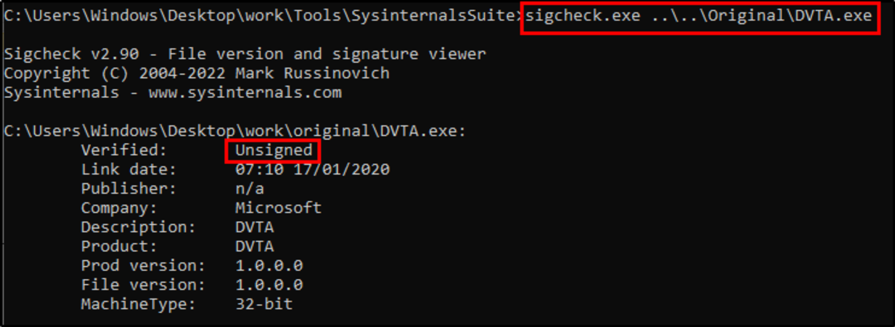
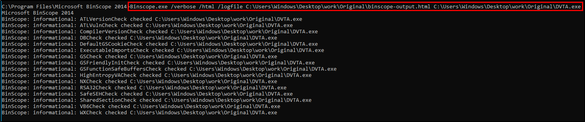
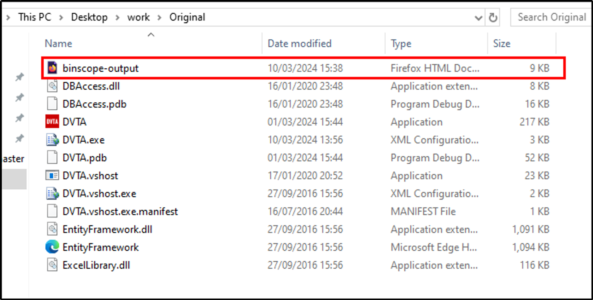
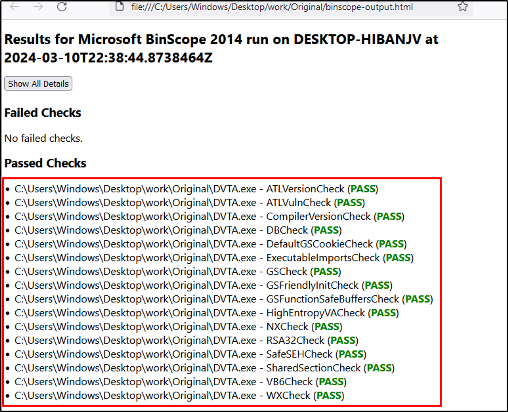
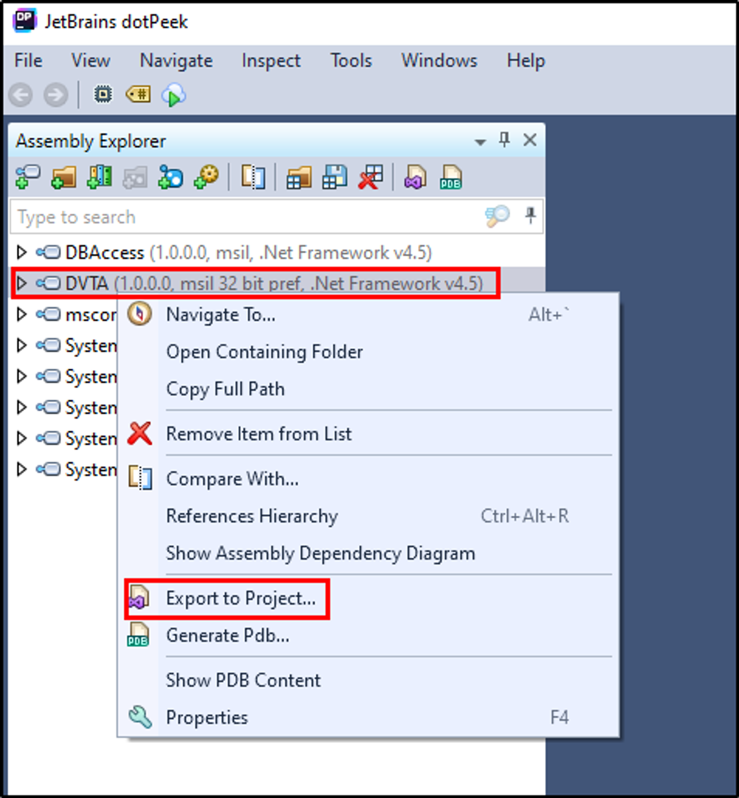
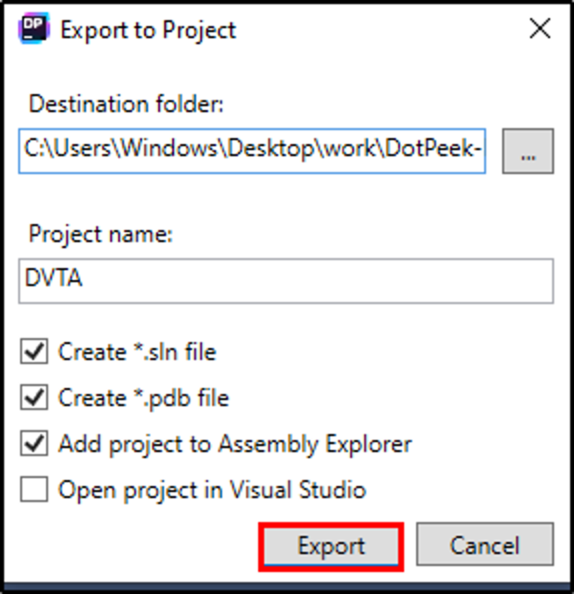
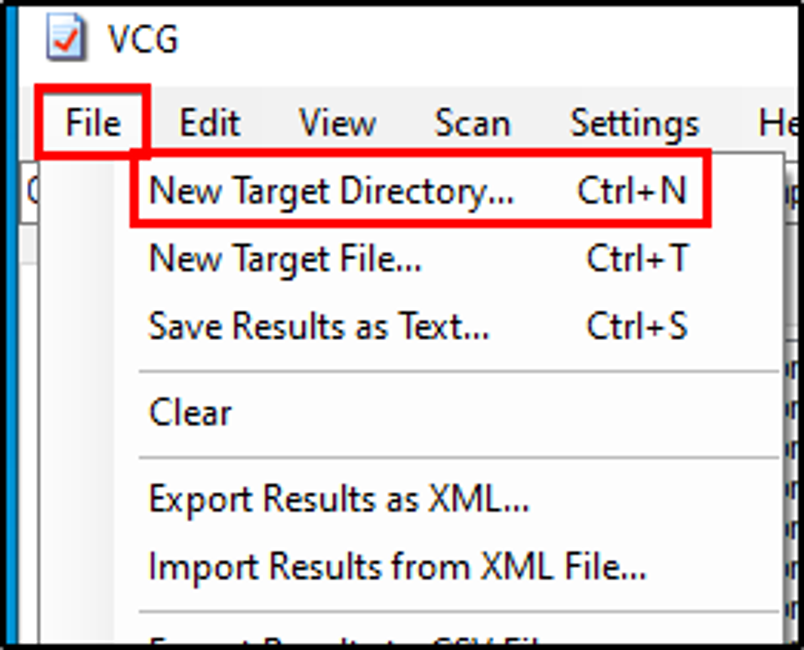
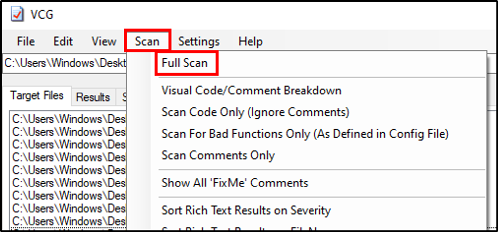
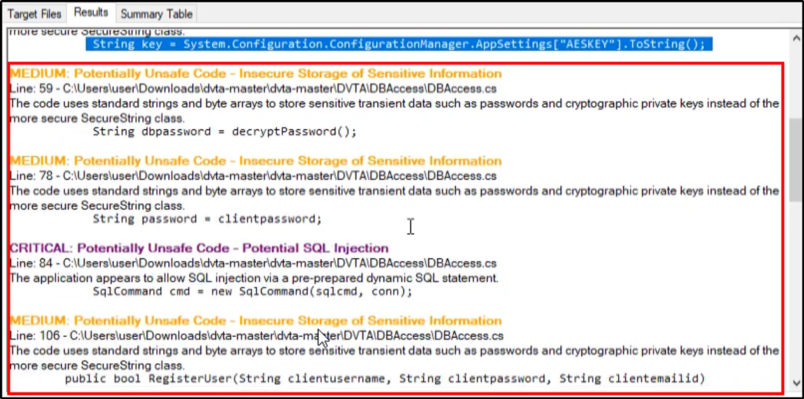

# Application Signing

---

<aside>
💡 Tool used: sigcheck (from sysinternalsuite)

</aside>

- Open `cmd` and navigate to **SysInternalSuite** directory.
- Use the below cmd to check the application is signed or unsigned.
```powershell
sigcheck.exe <App-Path>
```



--- 

# Compiler Protections

---

<aside>
💡 **Tools Used:** 
BinScope → https://www.microsoft.com/en-us/download/details.aspx?id=44995 OR https://download.cnet.com/binscope-binary-analyzer/3000-2383_4-75578438.html

</aside>

- Open path where **BinScope** is installed.
- Open `cmd prompt` and use the command below:

```csharp
Binscope.exe /verbose /html /logfile <Path-To-Log_File>\binscope-output.html <Application-Path>

Binscope.exe /verbose /html /logfile C:\Users\Windows\Desktop\work\Original\binscope-output.html C:\Users\Windows\Desktop\work\Original\DVTA.exe
```



- In original folder we can see a new html file is created, let’s open it.



- We can see all checks are passed, so if anything is failed we have to report it.



---

# Automated Source Code Scanning

---

<aside>
💡 **Tool Used:** 
Visual Code Grepper: https://sourceforge.net/projects/visualcodegrepp/

***How it works?***
This will scan the decompiled code and scan for potential vulnerabilities.

</aside>

- Download and install **Visual Code Grepper.**
- Open **DotPeek** and click on **File > Open > Selec DVTA** application.
- Right click on DVTA application and click on **Export to Project.**



- Next, select the suitable location for saving the decompiled project and hit **Export.**



- Now, open **Visual Code Grepper,** and click on **File > New Target Directory > Select decompiled directory.**



- When the files loads, click on **Scan > Full Scan.**



- In result, we have got number of vulnerabilities, so we can check them manually.

