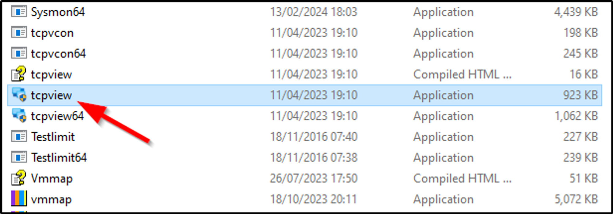
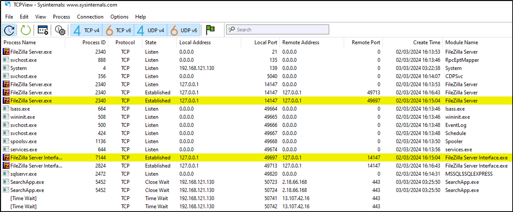

- Exploring the functionality of the application
- Architecture of the application
- Client's network communications
- Files that can be accessed by the client
- Look for juicy files

## Tools of the trade:

- CFF Explorer → https://ntcore.com/?page_id=388
- Sysinternal Suite → https://learn.microsoft.com/en-us/sysinternals/downloads/sysinternals-suite
- Wireshark → https://www.wireshark.org/download.html

---

# TCPVIEW - Network Connections

<aside>
💡 *TCPView from Sysinternals is a Windows utility that provides real-time monitoring of TCP and UDP connections, allowing users to view detailed information about processes, local and remote IP addresses, and connection states.*
</aside>

- Open **TCPView** from **SysinternalSuite** tools.

- When opened we got number of services that are using TCP and UDP connections.

- Let’s play with opening the DVTA application and see how it loads, trying logging using any user creds.
- From the image below we can see anew connection is made by DVTA application on port: 49820.

<aside>
💡 *Local Address and Remote Addresses are same because we have setup the server on the same machine on which we are using the application.*

</aside>

- So by this way we can see to which IP Address the application is communicating with.